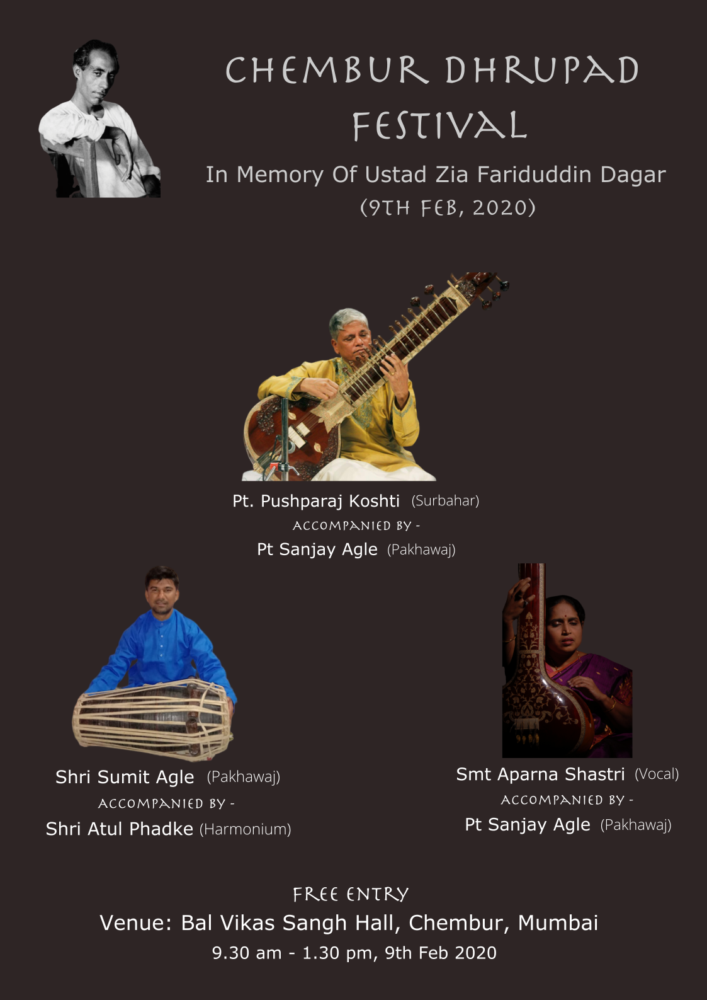
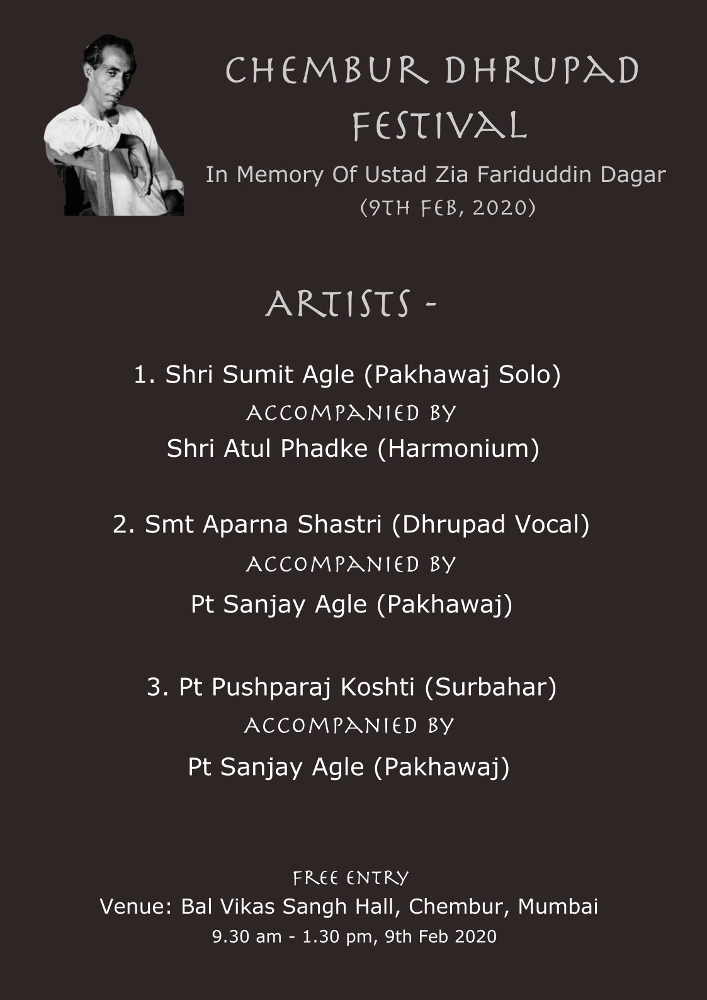

# Chembur Dhrupad Festival

We plan to organize a Dhrupad Festival every year in the memory of **Ustad Zia Fariduddin Dagar** and are happy to share details as follows -

## 1st Chembur Dhrupad Festival - Feb 9th, 2020

We are happy to announce the first "Chembur Dhrupad Festival" to be held on Feb 9th, 2020 at Balvikas Sangh Hall, Bal Vikas Sangh Marg, Near Gandhi Maidan, Chembur, Mumbai, Maharashtra 400071.

Please note that this a free event and everyone are invited, also we would appreciate if you could consider any form of donation, this is a completely community driven initiative and it needs contribution from everyone to keep this activity on-going and sustainable.
